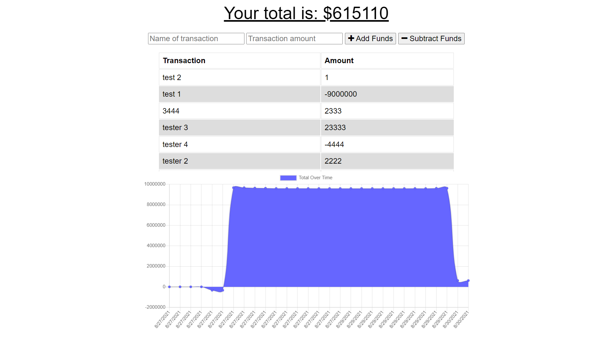

# Budget Tracker

Budget Tracker is a web application used to track your expenses over time to compare your spending habits. 

[Live Site!](https://fierce-eyrie-44884.herokuapp.com/)

## Description

- The creation of this project was motivated by wanting to allow the user to track their expeses so they can manage their bank account more easily. The user can add an expense online and offline. When the user then goes back online the data that was stored is now logged in the application and saved. 

## Table of Contents

  - [Description](#description)
  - [Table of Contents](#table-of-contents)
  - [Installation](#installation)
  - [Usage](#usage)
  - [Credits](#credits)
  - [License](#license)

## Installation

1. Provided that you have a code editor of your choosing installed on your system, such as VS Code (https://code.visualstudio.com/),

2. Either Clone or Fork this repository: git clone https://github.com/cbeard22/budgetTracker,

3. Create your own repository for the files on GitHub.

4. Edit to your liking and continue to commit, push changes and perform other Git actions using your repository https://docs.gitlab.com/ee/gitlab-basics/start-using-git.html.

5. Add this application to your heroku account and use the application link to access your Budget Tracker. 

## Usage

To utilize this page, simply click in the "Name of transaction" box to enter the title. Next, enter the amount in the "Transaction amount" box. Then click the "add or subtract fund button" and watch the site work its magic. 

## Credits
  - [Chris Beard](https://github.com/cbeard22)

- For this project I utilized:
- Javascript
- Mongoose
- MongoDB
- Express
- Node.js

- Tutorials Followed:
[Professional README guide template provided by Coding Boot Camp.](https://github.com/coding-boot-camp)

## License

- MIT License

- Copyright (c) [2021] [Chris Beard]

- Permission is hereby granted, free of charge, to any person obtaining a copy
of this software and associated documentation files (the "Software"), to deal
in the Software without restriction, including without limitation the rights
to use, copy, modify, merge, publish, distribute, sublicense, and/or sell
copies of the Software, and to permit persons to whom the Software is
furnished to do so, subject to the following conditions:

- The above copyright notice and this permission notice shall be included in all
copies or substantial portions of the Software.

- THE SOFTWARE IS PROVIDED "AS IS", WITHOUT WARRANTY OF ANY KIND, EXPRESS OR
IMPLIED, INCLUDING BUT NOT LIMITED TO THE WARRANTIES OF MERCHANTABILITY,
FITNESS FOR A PARTICULAR PURPOSE AND NONINFRINGEMENT. IN NO EVENT SHALL THE
AUTHORS OR COPYRIGHT HOLDERS BE LIABLE FOR ANY CLAIM, DAMAGES OR OTHER
LIABILITY, WHETHER IN AN ACTION OF CONTRACT, TORT OR OTHERWISE, ARISING FROM,
OUT OF OR IN CONNECTION WITH THE SOFTWARE OR THE USE OR OTHER DEALINGS IN THE
SOFTWARE.
